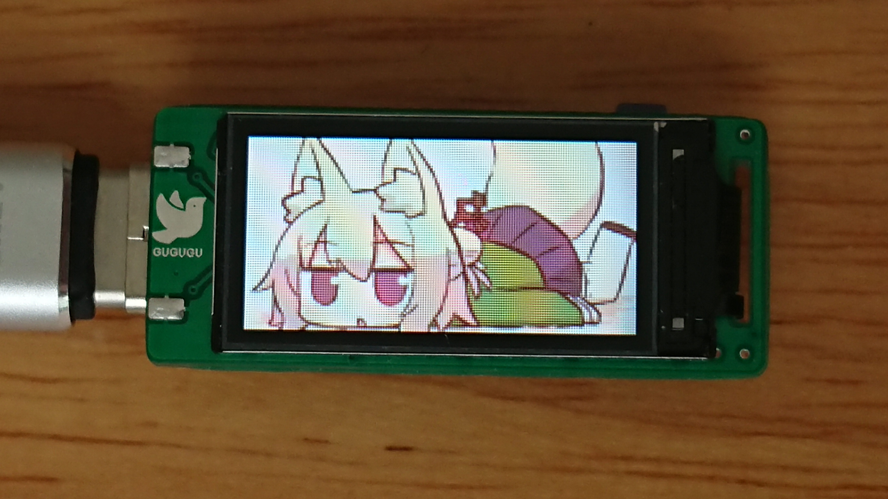

# Pigeon

The pigeon is a 0.96 inch mini USB screen based on STM32F042

## Photos

You can find more photos [here](./Images) .

## TODO
- [x] Support WINUSB
- [x] Support for function keys to simulate keyboards and send strings
- [x] Support custom screen orientation
- [x] Support custom splash screen (Support for up to four colors)
- [x] Support screen brightness adjustment

- [ ] Support for saving screen orientation from PC software
- [ ] Support for saving splash screen image from PC software
- [ ] Support for saving screen brightness from PC software
- [ ] Support for displaying static/moving images from PC software

- [ ] Some support for function key.
- [ ] More waiting to add...

## About the splash screen image

### The image encoding format
Pigeon's splash screen image uses RLE (Run-length encoding) data format.Other parts do not follow this encoding.  
Please note that it is not a standard RLE structure.  
Each RLE data consists of 16-bit data (2-bit color index and 14-bit pixel continuous length).  
The binary format is: `CCLL LLLL  LLLL LLLL`  
`CC` is a color index value, which ranges from 0 to 3. Support four colors in total.  
`LLLLLLLLLLLLLL` is the length of consecutive pixels, and its bit length is determined by the highest bit of the number of pixels on the screen.For example,Pigeon's screen resolution is 80x160. 80x160 = B110010 00000000.Its binary length is 14 bits.If you want to use it at other resolutions, this part may need to be recalculated.

### Customize
You can use the [img2rle.py](./SplashScreenGenerator/img2rle.py) script to generate your own splash screen image.

## License
MIT License Copyright (c) 2018 某10

### Logo License
The `Dove` icon is licensed under the Creative Commons Attribution 4.0 International license.[Link to the license](https://fontawesome.com/license)

## Desktop application
Preparing to develop a new application.  
you can find the application designed for the prototype [here](https://github.com/mo10/Mini-LCD-Controller).

## About the prototype
The prototype is built on the core board provided by EEFrog.  
You can find the schematic of the core board at [here](./Hardware/prototype/stm32f042_Mini_Sch.pdf).  
More information about this core board please check:https://www.eefrog.net/?p=449

