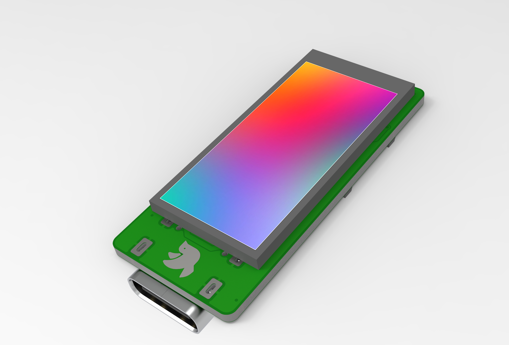
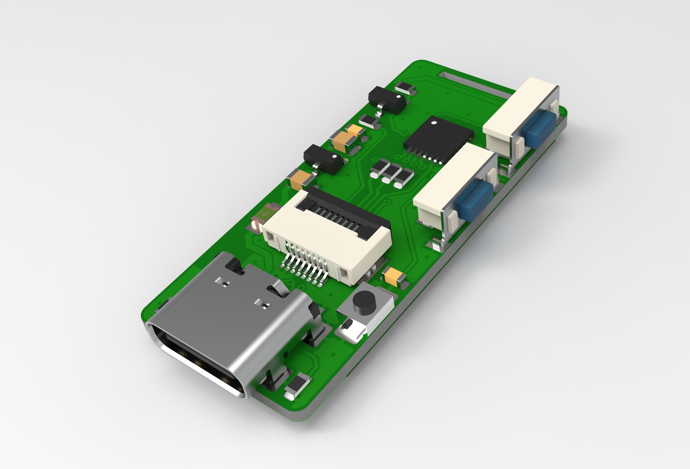

# Pigeon
  
The pigeon is a 0.96 inch mini USB screen based on STM32F042

## Rendering photos

 

## About the prototype
The prototype is built on the core board provided by EEFrog.  
You can find the schematic of the core board at [here](./Hardware/prototype/stm32f042_Mini_Sch.pdf).  
More information about this core board please check:https://www.eefrog.net/?p=449

## Desktop application
Preparing to develop a new application.  
you can find the application designed for the prototype [here](https://github.com/mo10/Mini-LCD-Controller).
