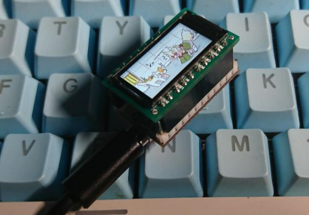

# Pigeon

A 0.96-inch full-color display using USB protocol and based on STM32F042

## Desktop application
see:[Github - Mini-LCD-Controller](https://github.com/mo10/Mini-LCD-Controller)

## About the core board

The project is currently built on the core board provided by EEFrog.

You can find the schematic of the core board at [here](./Hardware/stm32f042_Mini_Sch.pdf).

More information about this core board:https://www.eefrog.net/?p=449

## Download
see:[Appveyor - Pigeon](https://ci.appveyor.com/project/mo10/stm32-mini-lcd/build/artifacts)

## Images

